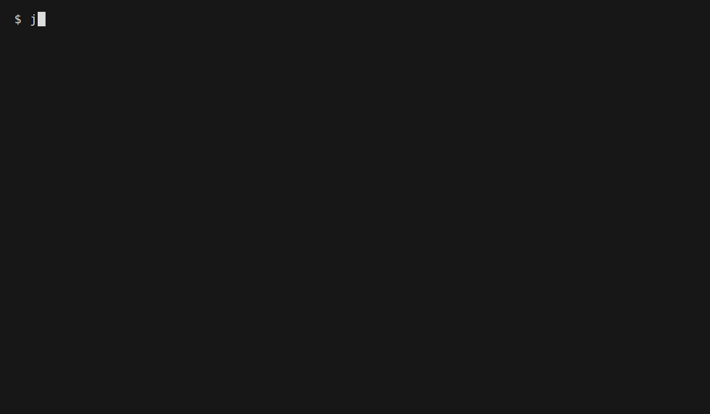
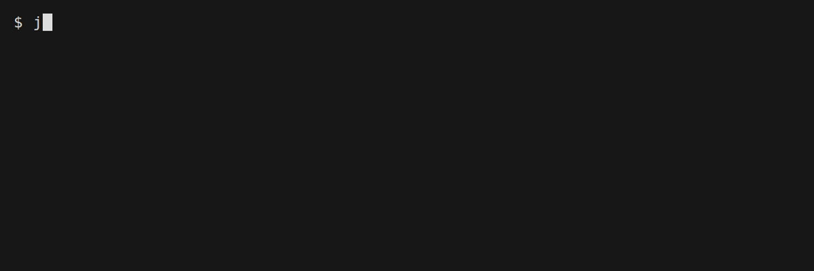
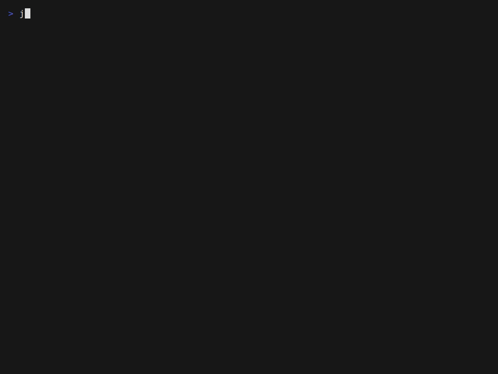
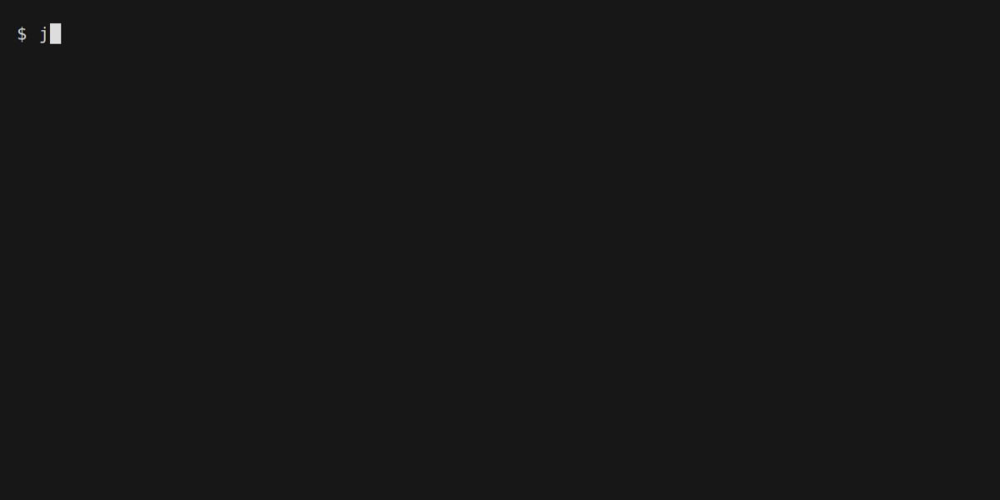
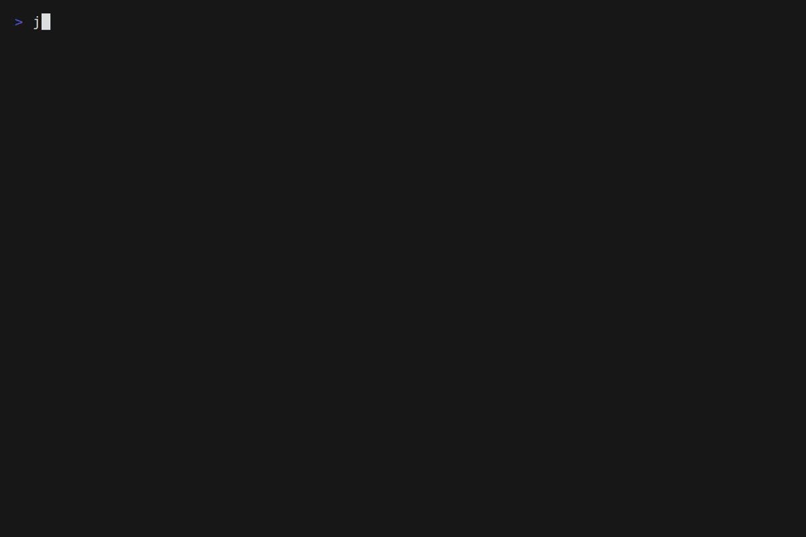
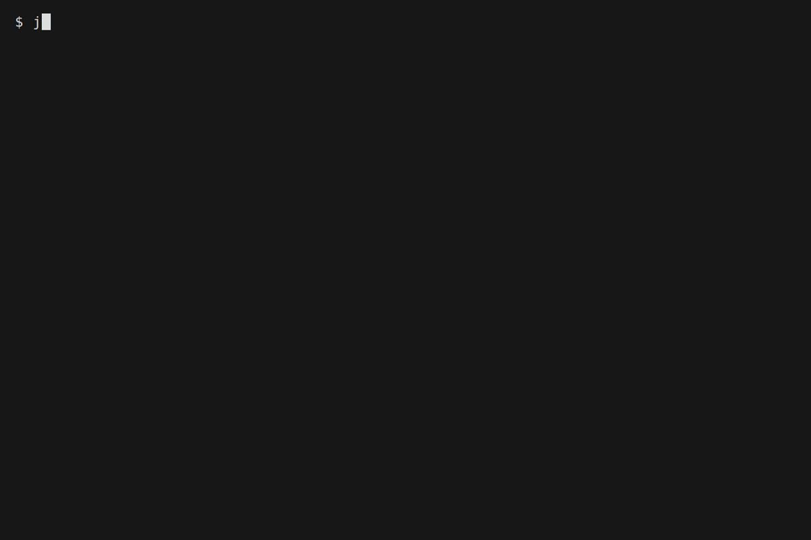
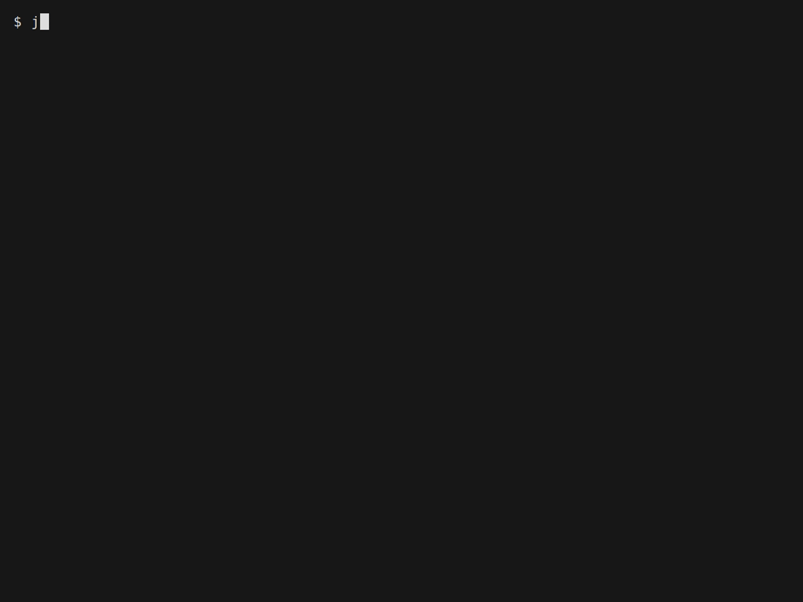

# jarvis — personal ops concierge CLI

Daily driver for notes, tasks, focus sessions, reminders, standup drafts, and calendar
integration. Built on [clift](https://github.com/tj-smith47/clift), the Task-based CLI
framework.

## Demo



## What it is

jarvis is a shell CLI for personal productivity. It manages focus sessions, note capture,
task tracking, reminders, and morning briefings — all profile-aware so work and home
contexts stay separate. Data lives in plain files (`~/.jarvis-state/<profile>/`); no
database, no daemon.

The CLI exercises the full clift framework surface: parsed and passthrough commands,
persistent flags, override slots, NDJSON integration contracts, Go + Rust + Python native
helpers compiled via `task build`. It functions both as a working daily-use tool and as
the reference dogfood implementation for clift development.

## Quick start

```bash
# Prerequisites: bash 4+, task (go-task), jq, yq
# Optional: gum (pretty prompts), go 1.21+, rust 1.70+, python 3.8+

# 1. Install clift framework:
git clone https://github.com/tj-smith47/clift "$HOME/.clift"
export PATH="$HOME/.clift/bin:$PATH"

# 2. Clone jarvis:
git clone https://github.com/tj-smith47/jarvis "$HOME/.jarvis"
cd "$HOME/.jarvis"

# 3. Build native helpers:
task build

# 4. Bootstrap the CLI (writes bin/jarvis wrapper + .env for *this* machine —
#    the committed .env is a template that points at relative dev paths):
task setup:cli

export PATH="$HOME/.jarvis/bin:$PATH"
jarvis --help
```

## Commands

| Command | Description |
|---------|-------------|
| `brief` | Morning briefing — calendar, PRs, jira, deploys, oncall |
| `coffee` | Log a coffee break to focus.log |
| `doctor` | Check jarvis health: profile, state schema, integrations |
| `focus` | Start a focus session |
| `note` | Capture a note (create or append, with frontmatter support) |
| `remind` | Schedule a reminder (cron or systemd backend) |
| `standup` | Standup draft — yesterday + today + blockers |
| `status` | Status dashboard — tasks, reminders, focus, jira |
| `task` | Add a new task |

## Recordings

Each command has a tape in [`.vhs/`](.vhs/) — re-render with `VHS_NO_SANDBOX=true vhs .vhs/<name>.tape`.

| | |
|---|---|
| **brief** — morning rollup |  |
| **coffee** — themed brew |  |
| **doctor** — health check |  |
| **focus** — pomodoro + stats |  |
| **note** — folder-tree notes |  |
| **remind** — schedule + list |  |
| **standup** — yesterday/today/blockers |  |
| **status** — dashboard + JSON |  |
| **task** — add/list/done |  |

## Profiles

jarvis is profile-aware. Pass `--profile <name>` (or `-p <name>`) before or after any
command; the flag is persistent so it applies across the whole invocation. Profile names
are unconstrained — `work` is the default seed, but you can name profiles whatever fits
your contexts (`home`, `oncall`, `opensource`, `clientx`, …). State directories, calendar
sources, Slack webhooks, and standup repo lists are all per-profile.

```bash
jarvis --profile home status
jarvis -p work brief --short
```

## Configuration

Two surfaces, two purposes:

**`.env`** — framework wiring, set once at install time by `task setup:cli`. Stores
`CLI_DIR`, `FRAMEWORK_DIR`, `CLIFT_MODE`, `LOG_THEME`. Not profile-specific.

**`~/.jarvis-state/<profile>/config.toml`** — per-profile credentials and preferences:

```toml
[calendar]
provider = "ics"          # ics | gcalcli | applescript | none

[calendar.ics]
source = "https://example.com/calendar.ics"

[notify.slack]
webhook = "https://hooks.slack.com/..."

[standup]
repos = ["owner/repo-a", "owner/repo-b"]

[scheduler]
backend = "cron"          # cron | systemd
```

## Architecture

Application conventions and sourced-library rules: [`CLAUDE.md`](CLAUDE.md)

Integration NDJSON contract (calendar, gh, jira, deploys, oncall): [`docs/ndjson-contract.md`](docs/ndjson-contract.md)

Native helpers:
- `jarvis-state` (Go) — state file reads/writes, frontmatter, focus log
- `jarvis-cal` (Rust) — ICS + gcalcli TSV to unified NDJSON event stream
- `jarvis-when` (Python, stdlib only) — natural-language time parsing for `remind`

## Development

```bash
export CLIFT_FRAMEWORK_DIR=/path/to/clift   # or $HOME/.clift

# Build native helpers:
task build

# Run full test suite:
bats tests/

# Lint:
shellcheck lib/**/*.sh cmds/**/*.sh

# Rust unit tests:
cargo test --manifest-path jarvis-cal/Cargo.toml
```

## License

MIT. See [LICENSE](LICENSE).
